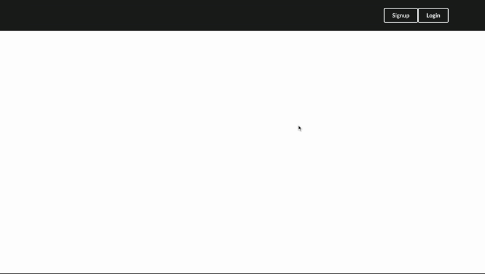

# Resources Xchange

It is a platform that introduces a new way of learning skills. :earth_americas: You can find skills that you are interested in and request a learning exchange with your current skills. :boom:

This website allows you to browse and search skills, find skill-owners around you, request Xchange sessions and review your learning experience.

## Motivation

The original ideal was inspired by the resources exchange or barters exsisted in the community(eg, The Time Doners), which makes me wonder if we bring it online and benifit more people who want to learn new skills. 

## Video Demo

https://youtu.be/ai8NupwpBpI

## Gif Demo
###### Log in to Home page

###### Browse skills and skill-owners

###### Find skill-owners all over the world

###### Make an xchange request

###### Edit profile info

###### View or cancel exchanges; Add or delete reviews

## Tech/framework used

###### Built with
- React
- React Hooks
- Redux
- JSON Web Token & localStorage
- Google Map Javascript API
- Moment.js
- Semantic UI React
- CSS

## Features

- Easy to find skills and skill-owners all over the world or nearby. 
- Easy request for an exchange and instant confirmation. 
- Easy to view all your exchanges and review the skill providers.

## Installation
Use `npm install && npm start` to run the application.

## How to use?

1. Register with username and password. 
2. Fill in your profile and skills to let people know you more!
3. Find skills and skill-owners you are interested. 
4. Make an instant request! :clap:
5. After finishing the exchange, do not forget to review exchange buddy!

## Credits
This is my final project when I was in Flatiron school, so many thanks to the instructors, coaches and my peers in the program!

## Backend Repo
Check out the [Backend Repo](https://github.com/yukiyao119/resources-exchange-backend) for this web application.

